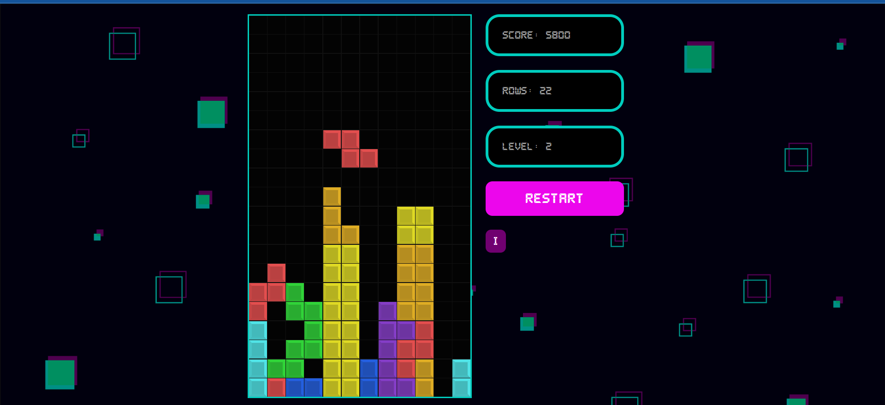

# Tetris Game 🎮

A modern, browser-based Tetris game built with React. Enjoy classic gameplay, smooth animations, and a pixel-inspired UI—all in a single-page app!

## Screenshot 📷




## Features ✨

- **Classic Tetris Gameplay:** Move, rotate, and drop tetrominos to clear lines and score points.
- **Responsive UI:** Works on desktop and mobile screens.
- **Styled Components:** Custom pixel-style visuals using `styled-components`.
- **Instructions & Controls:** In-game instructions and keyboard controls for an authentic experience.
- **Score & Level Tracking:** Displays your score, lines cleared, and current level.
- **Game Over Detection:** Handles collision and game over logic.

## Technologies Used 🧑‍💻

- React (functional components, hooks)
- styled-components (for custom styles)
- Create React App (project setup)
- JavaScript (game logic)
- CSS (pixel art, layout)
- [Optional] Images for backgrounds and UI

## Getting Started ▶️

1. **Clone the repository:**
	```sh
	git clone <your-repo-url>
	cd react-tetris
	```

2. **Install dependencies:**
	```sh
	npm install
	```
	> **Required packages:**  
	> - `react`, `react-dom`  
	> - `styled-components`  
	> - `@testing-library/react`, `@testing-library/jest-dom`, `@testing-library/user-event`, `@testing-library/dom` (for testing)  
	> - `react-scripts` (CRA)  
	> - `web-vitals` (performance)

	> **Important:**
	> This project uses `styled-components` for all custom styles. You must install it to run the project:
	> ```sh
	> npm install styled-components
	> ```

	> **Note for collaborators:**
	> If you install any new libraries, please add them to this list and mention their purpose in the README so everyone is aware of new dependencies!

3. **Start the development server:**
	```sh
	npm start
	```
	Open [http://localhost:3000](http://localhost:3000) in your browser.

## Project Structure 🏢

- `src/components/` – Game components (Tetris, Stage, Cell, Display, Instructions, etc.)
- `src/hooks/` – Custom React hooks for game logic (usePlayer, useStage, useInterval)
- `src/gameHelper.js` – Core game logic and utilities
- `src/img/` – Images for backgrounds and UI
- `src/index.js` – App entry point
- `src/index.css` – Global styles

## Customization ⚒️

- **Tetromino Shapes:** Edit `src/components/tetrominos.js` to change or add new shapes.
- **Styles:** Update `src/components/styles/` for custom colors, fonts, or layouts.
- **Instructions:** Modify `src/components/Instructions.js` for custom help text.

## License 📜

This project is open source and free to use for personal and educational purposes.

--- MADE WITH ❤️ FOR TETRIS FANS AND CODERS! ---
